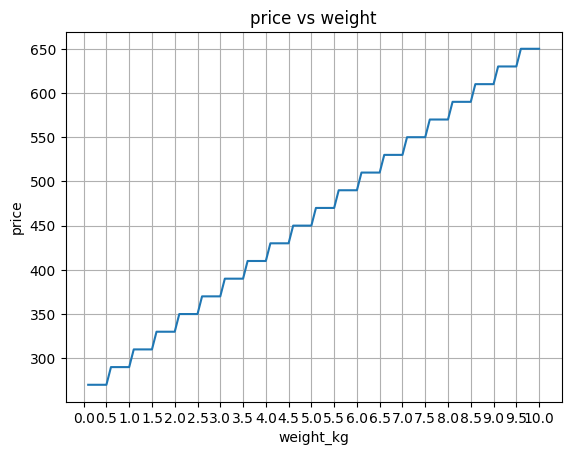
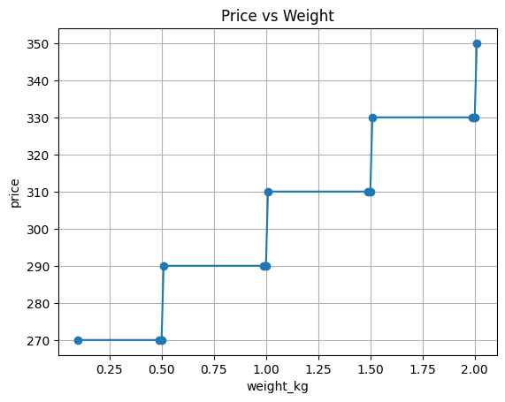
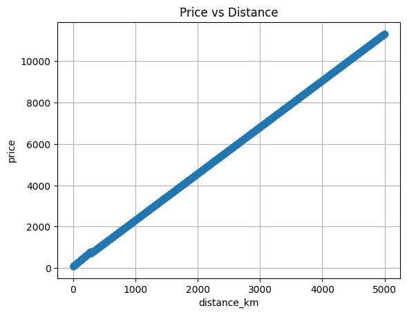
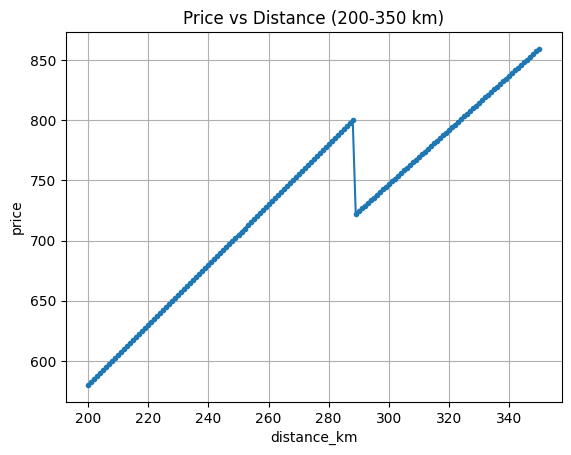
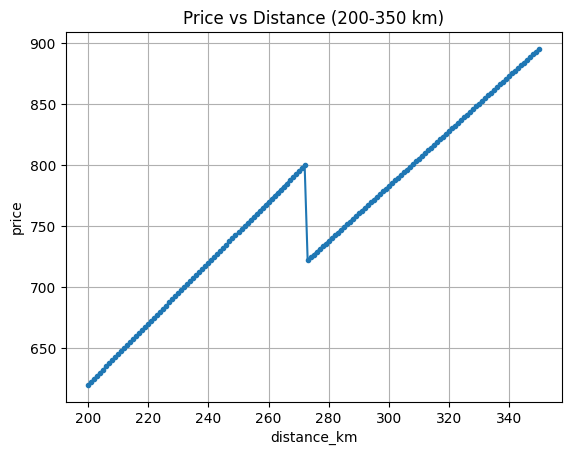
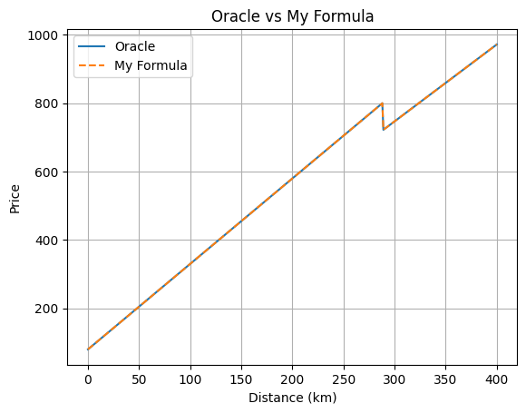

# SPEC --- Shipping Quote Engine (Black-Box Reverse Engineering)

Reconstructed purely by calling `oracle.quote()` and observing outputs.
Full probe journal: `Blackbox_Problem.ipynb` (37 cells). Final replica: `my_quote.py`.

Order of operations (matters):

$$ w_r = \left\lceil \frac{w}{0.5} \right\rceil \times 0.5, \quad P_{base} = 40 w_r + 2.5 d $$

$$ P_{cat} = \begin{cases} 1.3 P_{base} & \text{electronics} \\ P_{base}+150 & \text{fragile} \\ P_{base} & \text{otherwise} \end{cases}, \quad P_{bulk} = \begin{cases} 0.9 P_{cat} & P_{cat} > 800 \\ P_{cat} & \text{otherwise} \end{cases} $$

$$ P_{final} = \mathrm{round}(P_{bulk} - 100 \cdot \mathbf{1}_{coupon=\text{WELCOME10}},\,2) $$

## Reconstructed rules

1.  Weight is rounded UP to the nearest 0.5 kg:
    `rounded_weight = ceil(weight / 0.5) * 0.5`
    Every 0.5 kg adds Rs 20 (Rs 40/kg). Notebook Cells 3-6.

    

    ```python
    quote(0.5, 100, "standard", False, "")  # 270.0
    quote(0.6, 100, "standard", False, "")  # 290.0 (+20, up to 1.0 kg tier)
    quote(1.0, 100, "standard", False, "")  # 290.0
    quote(1.1, 100, "standard", False, "")  # 310.0 (+20, up to 1.5 kg tier)
    ```

    Boundary zoom (Cell 5: `0.49/0.50/0.51`, `1.49/1.50/1.51`):

    

2.  Base price: `P_base = 40 * rounded_weight + 2.5 * distance`
    Distance is a linear Rs 2.5/km with no rounding (Cell 8: 1-5000 km sweep).

    

    ```python
    quote(2.0, 100, "standard", False, "")  # 40*2.0 + 2.5*100 = 330.0
    quote(1.0, 10, "standard", False, "")   # 40*1.0 + 2.5*10 = 65.0
    quote(2.0, 101, "standard", False, "")  # 332.5 (+2.5 for +1 km)
    ```

3.  Category:
    -   `electronics` → `P_base * 1.30` (Cell 20: `429/330 = 1.3`, consistent in Cell 22 grid)
    -   `fragile` → `P_base + 150` (Cell 20: `480 - 330 = 150`, consistent in Cell 22 grid)
    -   everything else (`standard`, `books`, `clothing`, `food`, invalid) → unchanged

    ```python
    quote(2.0, 100, "electronics", False, "")  # 429.0
    quote(2.0, 100, "fragile", False, "")      # 480.0
    quote(2.0, 100, "books", False, "")        # 330.0
    ```

4.  Bulk discount:
    -   if the category-adjusted price is strictly greater than Rs 800,
        multiply by `0.90`

    ```python
    quote(2.0, 288, "standard", False, "")    # 800.0 (== 800, NO discount)
    quote(2.0, 288.5, "standard", False, "")  # 721.12 (801.25 * 0.9)
    quote(2.0, 289, "standard", False, "")    # 722.25 (802.5 * 0.9)
    ```

    After discount the slope is `2.25/km` (Cell 11).

5.  Coupon:
    -   exact `WELCOME10` subtracts Rs 100 (fixed, applied last, can go negative)
    -   case-sensitive; nothing else hits (5000-code brute force: only `WELCOME10`)

    ```python
    quote(2.0, 100, "standard", False, "WELCOME10")  # 230.0
    quote(2.0, 100, "standard", False, "welcome10")  # 330.0 (ignored)
    quote(1.0, 10, "standard", False, "WELCOME10")   # -35.0
    quote(2.0, 100, "fragile", False, "WELCOME10")   # 380.0
    ```

6.  Final result is rounded to 2 decimals.

    ```python
    quote(1.0, 1.111, "standard", False, "")  # 42.78
    ```

7.  `express` has no observed effect (Cells 27-29: `False` vs `True` over
    weights x distances x categories, difference always 0).

    ```python
    quote(2.0, 100, "standard", False, "")  # 330.0
    quote(2.0, 100, "standard", True, "")   # 330.0
    ```

## Important breakpoint finding

The integer-distance breakpoint `321 - 16 * weight` was an early
empirical observation, not the underlying rule (Cells 13-15).

Cell 9 (200-350 km, w=2.0) shows the notch; Cell 12 repeats at w=3.0 and the
notch moves (~273 km), proving the trigger moves with weight:





Fractional-distance testing disproved it (Cell 16). For `weight=2.0`:

-   `288.0 km` → `800.0` → no discount
-   `288.5 km` → `801.25` → 10% discount
-   `289.0 km` → `802.5` → 10% discount

Therefore the actual trigger is:

``` python
if price > 800:
    price = price * 0.90
```

## Category ordering

Category adjustment happens before the bulk discount (Cell 24).

For example:

``` python
quote(2.0, 230, "standard", False, "")  # 655.0
quote(2.0, 230, "fragile", False, "")   # 724.5
```

The fragile price is `655 + 150 = 805`, then `805 * 0.9 = 724.5`.
Counter-case: `quote(1.0, 240, "fragile") = 790.0` (`640 + 150 = 790`, not > 800, no discount).

## Rejected hypotheses

### Fixed distance breakpoint

Rejected because the transition changes with weight (Cell 12: w=2 breaks ~288-289, w=3 breaks ~272-273).

### `321 - 16 * weight` as the actual rule

Rejected by fractional-distance tests (Cells 16-17): `288.5` and `272.x` discount
even though they sit below the integer breakpoints.

### Fragile as a multiplier

Rejected (Cell 21 idea `x1.4545`) because multi-point tests (Cell 22) show a constant `+150` offset.

## Final implementation

``` python
import math

def my_quote(weight, distance, category, express=False, coupon=""):

    rounded_weight = math.ceil(weight / 0.5) * 0.5

    price = 40 * rounded_weight + 2.5 * distance

    if category == "electronics":
        price = price * 1.30

    elif category == "fragile":
        price = price + 150

    if price > 800:
        price = price * 0.90

    if coupon == "WELCOME10":
        price = price - 100

    price = round(price, 2)

    return price

quote = my_quote
```

Validated in Cell 36 by overlaying oracle vs replica over d=0-400 (curves coincide):



## Investigation summary

The investigation proceeded one parameter at a time (notebook order):

`weight (Cells 2-6) → distance (Cells 7-18) → category (Cells 19-25) → express (Cells 26-30) → coupon (Cells 31-32)`

- Baseline `quote(2.0, 100, "standard") = 330.0` (Cell 1), tracked with `queries_used()` / `reset_counter()`.
- Weight graph exposed 0.5 kg stairs (+20); boundary probes pinned `ceil(w/0.5)*0.5`.
- Distance graph exposed 2.5/km plus one notch; integer zoom (280-296) plus fractional probes (288.x, 272.x) converted the distance-breakpoint idea into the price rule `> 800`.
- Category sweep + weight x distance x category grid separated the `x1.3` multiplier from the `+150` offset and proved the `books/clothing/food = standard` collapse.
- Express grid (weights x distances x categories) returned all-zero differences: recorded as no-effect rather than dropped.
- Coupon deltas were a constant 100 across small/large/discounted totals (incl. negative `-35.0`); 5000-candidate brute force left only exact `WELCOME10`.

The important distinction is between **observed patterns** and the
**underlying rule**: the `321 - 16 * weight` expression described
several integer breakpoints, but the experiments showed that the real
condition is based on the category-adjusted price crossing Rs 800.
